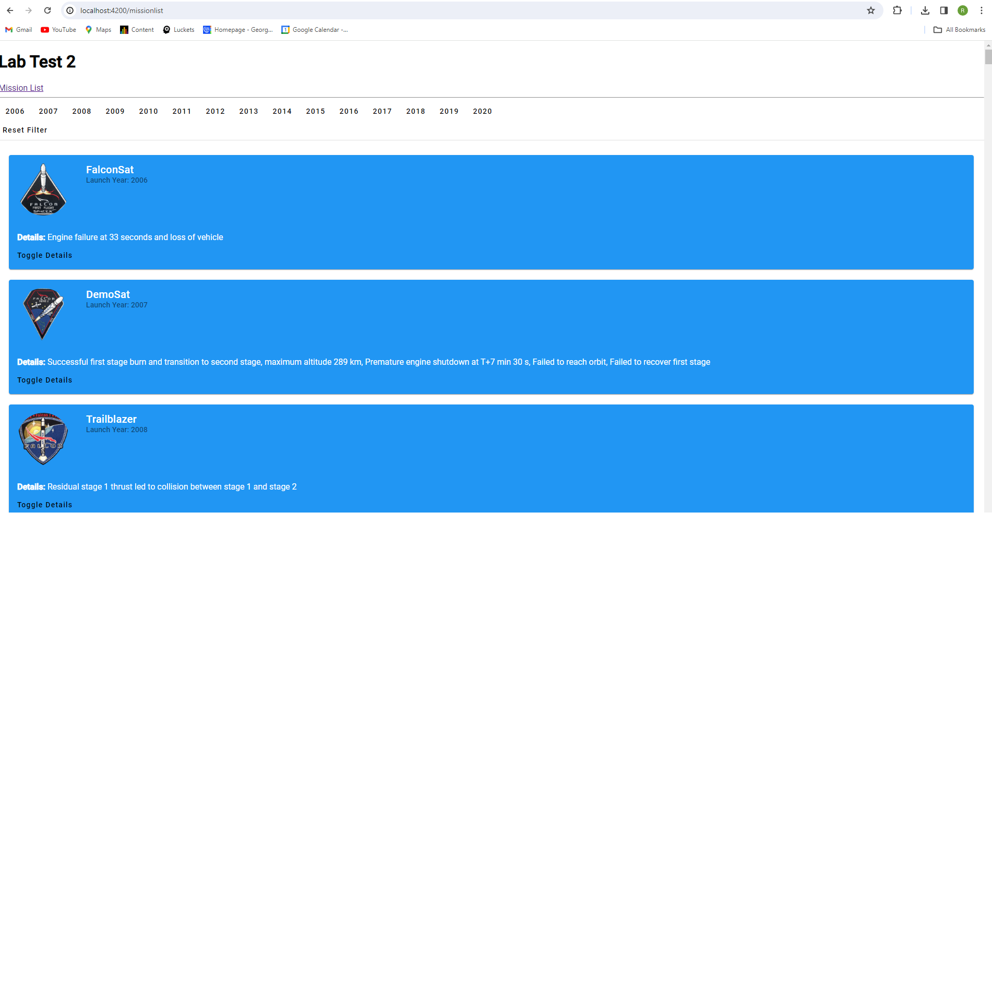
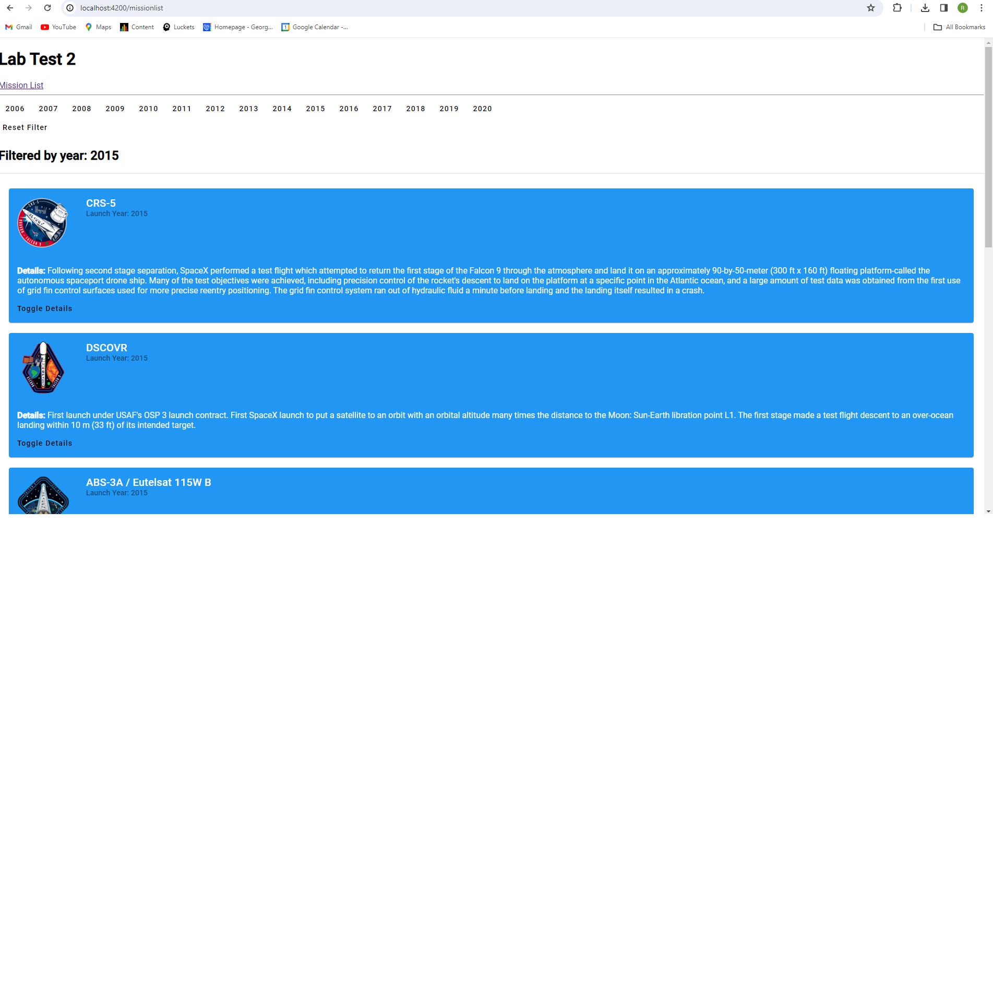
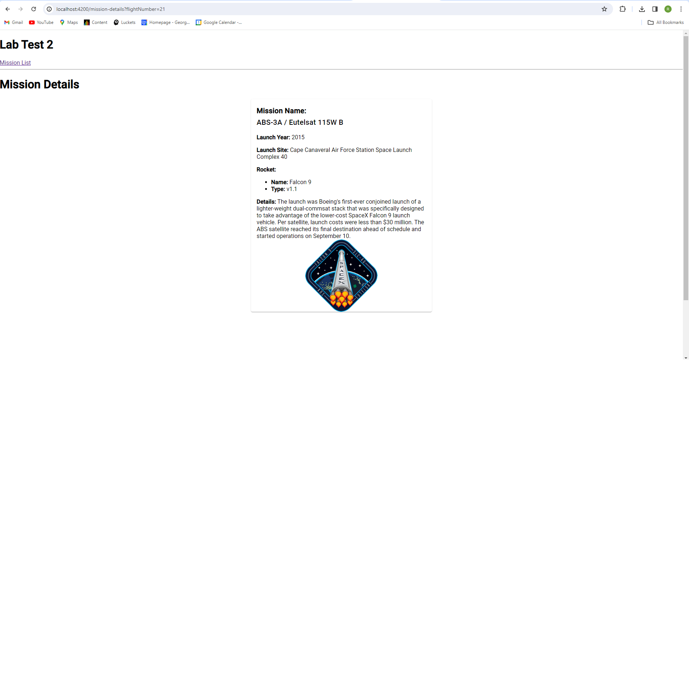

# Angular Mission List App

This application was built with Angular. It displays a list of missions, allows filtering by launch year and allows user to view mission details. 

## Screenshots
*Screenshot of Mission List*

*Screenshot of missions filtered by year*

*Screenshot of Mission Details*

## Features

- Displays a list of missions fetched from an API
- Allows filtering missions by launch year
- Provides mission details on click

## Installation

To run this app locally:

1. Clone this repository: `git clone (github url)`
2. Navigate to the project directory: `cd 101342857-lab-test2-comp3133`
3. Install dependencies: `npm i`
4. Run the development server: `ng serve`
5. Navigate to `http://localhost:4200/`

## Usage

- Browse the list of missions.
- Use the sidebar buttons to filter missions by launch year.
- Click on the toggle details to view a missions details.

## Credits

This app was created by Rodrigo Elustondo.

# 101342857LabTest2Comp3133

This project was generated with [Angular CLI](https://github.com/angular/angular-cli) version 17.2.3.

## Further help

To get more help on the Angular CLI use `ng help` or go check out the [Angular CLI Overview and Command Reference](https://angular.io/cli) page.
